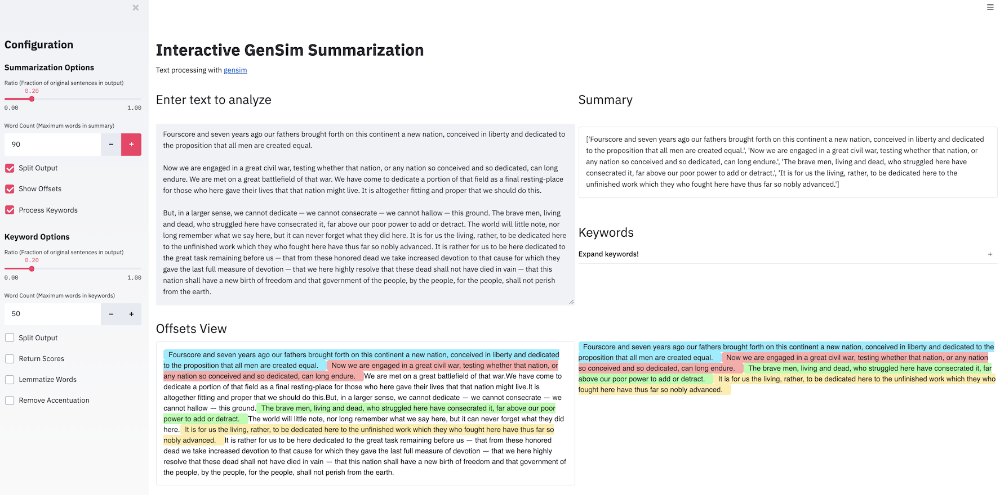

# Gensim With Streamlit

A simple example to summarize text in Streamlit with [Gensim](https://radimrehurek.com/gensim/index.html). 

.

## Live demo

[Demo (Heroku deployment)](https://streamlit-gensim.herokuapp.com/)

## Installation

```bash
pip install -r requirements.txt
```

The dependencies are:
* streamlit
* gensim
* [htbuilder](https://github.com/tvst/htbuilder)

Annotations were borrowed from [st-annotated-text](https://github.com/tvst/st-annotated-text).

## Run

```bash
streamlit run gensim_example.py
```